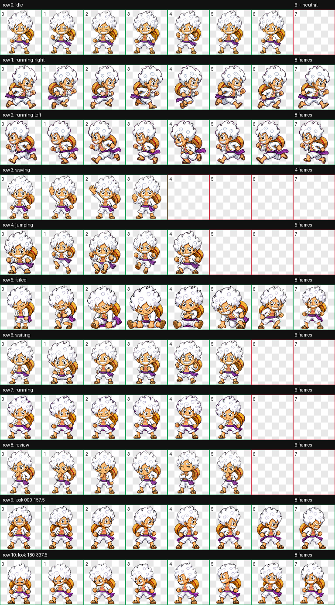

# Luffy Gear 5 Codex Pet V2

[中文](#中文) · [English](#english)

## 中文

这是一个面向 Codex Desktop 的**非官方、非商业**宠物包。它基于
[jordsshmords1](https://codex-pets.net/users/jordsshmords1) 创作的
[“Luffy Gear 5” Codex 宠物](https://codex-pet.org/pets/luffy-gear-5/)，
在保留原有角色造型与主要动画的基础上升级到 Codex 宠物 v2。

### V2 改动

- 将图集从 v1 的 8×9 动画布局扩展为 v2 的 8×11 布局。
- 新增 16 个按顺时针排列的环视方向。
- 修复失败动画中的游离特效。
- 将非方向性的任务运行状态调整为专注处理工作的动作，不再表现为跑步。
- 完成透明度、色键、图集结构、方向语义和最终视觉检查。

### 安装

下载最新 Release 中的 `luffy-gear-5-v2.codex-pet.zip`，解压后将
`luffy-gear-5-v2` 文件夹放入：

~~~text
~/.codex/pets/
~~~

最终结构应为：

~~~text
~/.codex/pets/luffy-gear-5-v2/
├── pet.json
└── spritesheet.webp
~~~

重新打开 Codex Desktop，进入外观设置并选择 **Luffy**。

### 致谢与来源

原始 v1 宠物由
[jordsshmords1](https://codex-pets.net/users/jordsshmords1) 创作。
原始社区包由
[legeling/awesome-codex-pet](https://github.com/legeling/awesome-codex-pet/tree/main/pets/luffy-gear-5--jordsshmords1)
收录和分发。

衷心感谢 jordsshmords1 创作原始宠物，也感谢
[awesome-codex-pet](https://github.com/legeling/awesome-codex-pet)
维护者对社区资源的整理与分享。

本仓库只负责 v2 方向动画扩展和相关动画修复，不主张拥有原始角色设计或原始
v1 精灵图的原创权。详细来源与修改记录见 [ATTRIBUTION.md](ATTRIBUTION.md)。

### 使用与权利说明

本项目仅供个人、非商业的同人和学习使用。上游目录记录了原始作者对非商业仓库
再分发的授权；本项目目前没有取得一份专门针对本次修改版的额外授权，因此不得
将本仓库视为宽泛的开源许可或商业授权。详情见
[ASSET-LICENSE.md](ASSET-LICENSE.md)。

Monkey D. Luffy、Gear 5、ONE PIECE 及相关角色与标识的权利属于其各自权利人。
本项目与 Eiichiro Oda、Shueisha、Toei Animation、OpenAI 或相关权利人没有
官方关联，也不代表其认可或背书。

## English

This is an **unofficial, non-commercial** pet package for Codex Desktop. It is
a v2 derivative upgrade of the original
[“Luffy Gear 5” Codex pet](https://codex-pet.org/pets/luffy-gear-5/) created by
[jordsshmords1](https://codex-pets.net/users/jordsshmords1).

### What changed in V2

- Expanded the atlas from the v1 8×9 layout to the v2 8×11 layout.
- Added a complete clockwise loop of 16 look directions.
- Removed detached effects from the failed animation.
- Changed the non-directional task-running state into focused work rather than
  literal locomotion.
- Validated transparency, chroma cleanup, atlas structure, direction semantics,
  and final visual quality.

### Installation

Download `luffy-gear-5-v2.codex-pet.zip` from the latest Release. Extract it
and place the `luffy-gear-5-v2` folder under:

~~~text
~/.codex/pets/
~~~

The installed package should look like:

~~~text
~/.codex/pets/luffy-gear-5-v2/
├── pet.json
└── spritesheet.webp
~~~

Restart Codex Desktop, open its appearance settings, and select **Luffy**.

### Credits and upstream source

The original v1 pet was created by
[jordsshmords1](https://codex-pets.net/users/jordsshmords1) and distributed in
the community collection at
[legeling/awesome-codex-pet](https://github.com/legeling/awesome-codex-pet/tree/main/pets/luffy-gear-5--jordsshmords1).

Many thanks to jordsshmords1 for creating the original pet, and to the
[awesome-codex-pet](https://github.com/legeling/awesome-codex-pet) maintainers
for preserving and sharing the community package.

This repository adds Codex pet v2 look-direction support and related animation
repairs. It does not claim authorship of the original character design or the
original v1 sprite artwork. See [ATTRIBUTION.md](ATTRIBUTION.md) for details.

### Use and rights notice

This project is intended only for personal, non-commercial fan and educational
use. The upstream catalog records authorization from the original creator for
non-commercial repository redistribution. No additional permission specifically
covering this modified v2 derivative has been obtained, so this repository must
not be treated as a broad open-source license or commercial-use authorization.
See [ASSET-LICENSE.md](ASSET-LICENSE.md).

Monkey D. Luffy, Gear 5, ONE PIECE, and related characters and marks belong to
their respective rights holders. This project is not affiliated with or
endorsed by Eiichiro Oda, Shueisha, Toei Animation, OpenAI, or any related
rights holder.

## Package specification

- Pet ID: `luffy-gear-5-v2`
- Sprite contract: Codex pet v2
- Atlas: `1536×2288` WebP with transparency
- Grid: 8 columns × 11 rows
- Cell size: `192×208`
- Standard animation rows: 9
- Look-direction cells: 16

The focused direction preview is available at
[preview/look-directions.png](preview/look-directions.png).
